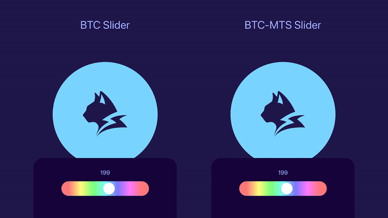
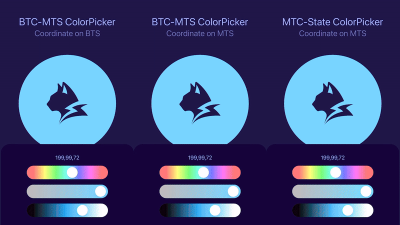

# MTC Color Picker


This repository demonstrates why **Main Thread Components (MTC)** are needed in [Lynx](https://lynxjs.org).

It provides a set of demos that compare the **BTC**, **BTC-MTS**, and **MTC** component patterns, highlighting how **MTC restores declarative programming on the main thread within Lynx's dual-threaded architecture**.

## Motivation

### Problem

Traditional **Background Thread Components (BTC)** can become unresponsive when the background thread is blocked by heavy computation.

### Symptom

To solve this, **BTC-MTS (Main Thread Scripting)** coordination moves critical UI logic onto the main thread, keeping the UI responsive.

But it comes with significant complexity.

Since the **BTC-MTS** pattern is fundamentally imperative, what should be **prop-driven state** can no longer flow reactively. Instead, it turns into **externally driven state** that must be pushed through explicit writer calls.

The same applies to styles or values that depend on other components (e.g., a Hue slider background calculated from Saturation and Lightness): they, too, require explicit writer calls rather than updating automatically.

At first glance, styles can react to their core visual value (a slider's thumb offset, for example). But the moment a style depends on **other components**, it can no longer behave as a mere callback; it must be explicitly coordinated through writers.

As a result, developers encounter the following **MTS friction in abstracting UI components**:

- **More props**. Every **externally driven value or style** needs both an initial value and explicit writer calls, effectively doubling the prop surface.

- **More** `MainThreadRef` **bindings**. Internal writer methods must be bound to external refs.

- **More** `"main thread"` **annotations**. Imperative writers often split into separate helper functions, each requiring its own directive and contributing to scattered annotations across the codebase.

Such friction **accumulates at every abstraction layer**, turning minor inconveniences into systemic overhead.

### Solution

**MTC removes this burden.** Externally driven state flows naturally through declarative props, **eliminating the need for imperative chaining**.

In practice, developers can write code that looks **almost identical to BTC**, but without the bloated props, ref hell, or directive clutter. At the same time, **MTC preserves the responsiveness** of **BTC-MTS** under background blocking.

## Compositional Patterns

This repo includes multiple demos that illustrate the evolution of component patterns across Lynx's dual-threaded architecture (**BTC → BTC-MTS → MTC**).

### BTC

- **BTC Slider** – baseline: pure BTC, vulnerable to blocking.

### BTC-MTS

- **BTC-MTS Slider** – introduces MTS coordination.
- **BTC-MTS ColorPicker (Coordinate on BTS)** – coordination still on BTS, limited.
- **BTC-MTS ColorPicker (Coordinate on MTS)** – coordination on MTS, resilient but verbose.

### MTC

- **MTC-State ColorPicker (Coordinate on MTS)** – state-based variant.
- **MTC-Signal ColorPicker (Coordinate on MTS)** – signal-based variant.
- **MTC-State ColorPicker (with a BTC Child)** – composability demo: nesting BTC inside MTC.

## Background Blocking Experiments

To validate these patterns in practice, we run blocking experiments under simulated heavy load: every `100ms` a task is scheduled and each blocks for `250ms`, creating sustained congestion. We then compare how **BTC**, **BTC-MTS**, and **MTC** patterns behave.

### Sliders: BTC vs BTC-MTS



First, we test the simplest case: a single Slider under blocking.

- **BTC Slider** – the **thumb stops following your drag** (UI freezes) because all updates run on the blocked background thread.
- **BTC-MTS Slider** – the **thumb stays responsive and smooth** as coordination is moved onto the main thread (MTS).

This highlights the core issue: **BTC alone is vulnerable to blocking**, while **BTC-MTS preserves responsiveness**.

### ColorPickers: BTC-MTS vs MTC



Next, we compare three ColorPickers variants under background blocking:

- **BTC-MTS (BTS Coord)** – coordination stays on the background thread, so slider gradients **freeze and stutter** when the thread is blocked.
- **BTC-MTS (MTS Coord)** – coordination runs on the main thread, so gradients **stay smooth and responsive** even under blocking.
- **MTC** – gradients are **equally smooth**, but with a **declarative API** (no `MainThreadRef` or scattered directives).

Both **BTC-MTS (MTS Coord)** and **MTC** remain silky under blocking; **BTC-MTS (BTS Coord)** does not. **MTC achieves the same responsiveness with a declarative surface**.

## Key Takeaways

- **BTC** – simple, but freezes under heavy load.
- **BTC-MTS** – responsive, but verbose and imperative.
- **MTC** – combines **BTC's simplicity** with **BTC-MTS's resilience**.

Together, these demos serve as a proof of concept for the **declarative approach** in Lynx's **dual-threaded model**, showing how **MTC** removes the imperative burden while keeping the UI fully responsive under background blocking.

## How to Explore

### Rspeedy Project

This is a [ReactLynx](https://lynxjs.org/react/) project bootstrapped with [`create-rspeedy`](https://lynxjs.org/rspeedy/).

Install dependencies:

```bash
pnpm install
```

Run the development server:

```bash
pnpm run dev
```

Scan the QR code in the terminal with your **LynxExplorer App** to see the result.

### LynxExplorer App

To view the demos on your mobile device, install the **LynxExplorer App**:

- [Android](https://github.com/lynx-family/lynx/releases/latest) – official Lynx Android release (via GitHub Releases)
- [iOS](https://apps.apple.com/ca/app/lynx-go-dev-explorer/id6743227790) – community build available on the App Store.

Make sure your **computer and mobile device are on the same network**, then scan the QR code printed in the terminal to open the demo directly in the app.

You have finished the basic setup required to run any example in this repo. For more details, see the [Starting Guide](https://lynxjs.org/guide/start/quick-start.html).

### Testing Background Blocking

Now, let's try a blocking scenario together.

Run with blocking enabled (demo mode):

```bash
pnpm run demo
```

The demo command runs the dev server with the following environment variable:

```json
"scripts": {
  "demo": "cross-env LYNX_DEMO_BLOCKING_ENABLED=true rspeedy dev",
}
```

- `LYNX_DEMO_BLOCKING_ENABLED=true` → enables blocking mode.
- Default (`dev`, `build`, `preview`) → blocking disabled.

From here, you can reproduce our experiments and observe how different patterns respond.

### Switch Demo Entries

Press `r` in your terminal to open the entry switcher. Use the up and down `↑`/`↓` arrow keys to navigate between entries, and press `Enter` to load the selected demo.

## Demo Entries

For reference, here is the mapping between the conceptual demo names and the actual entry keys:

| Demo name (docs)                           | Entry key (in `lynx.config.ts`) |
| ------------------------------------------ | ------------------------------- |
| BTC Slider                                 | `BTCSlider`                     |
| BTC-MTS Slider                             | `BTCMTSSlider`                  |
| BTC-MTS ColorPicker (Coordinate on BTS)    | `BTCMTSColorPicker-BTSCoord`    |
| BTC-MTS ColorPicker (Coordinate on MTS)    | `BTCMTSColorPicker-MTSCoord`    |
| MTC-State ColorPicker (Coordinate on MTS)  | `MTCColorPicker-State`          |
| MTC-Signal ColorPicker (Coordinate on MTS) | `MTCColorPicker-Signal`         |
| MTC-State ColorPicker (with a BTC Child)   | `MTCColorPicker-BTC`            |

## Banner Design Concept

The hero banner visually encodes the ideas behind this repo:

- **Circles** – solid circles represent **BTC** and **MTC**.
- **Lynx silhouette** – rendered in outer **BTC** component (top-level App):
  - **Filled part** – changes with the ColorPicker, symbolizing reactive UI updates.

  - **Knockout part** – acts as a cut-out path, symbolizing **MTS** shuttling between **BTC** and **MTC**.

- **ColorPicker & sliders** – represent the **MTC** components from the demos, handling interaction and state updates.

- **Numeric display inside the ColorPicker** – shows a nested BTC child component.

- **Gradients** – symbolize **externally driven style** in the demos (e.g., a background depending on saturation and lightness).

## Acknowledgements

This work is the result of a collective effort. The demos and design insights grew out of our shared discussions, experiments, and implementation work around MTC, ReactLynx, LynxUI, and the dual-threaded model. Thanks to everyone on the team who contributed ideas and feedback throughout the process.
