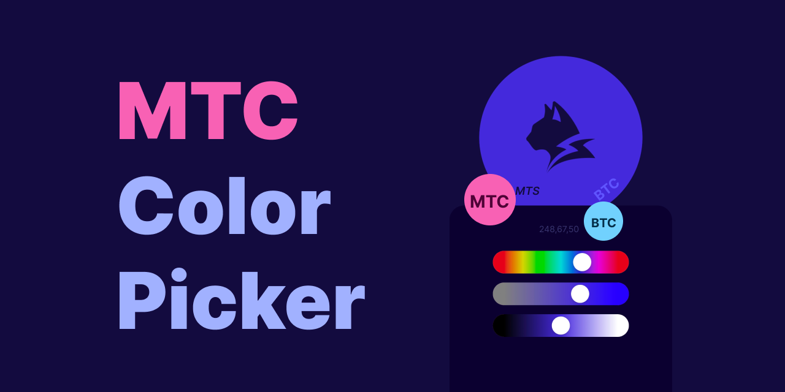

# MTC Color Picker



This repository demonstrates why **Main Thread Components (MTC)** are needed in [Lynx](https://lynxjs.org).

It provides a set of demos that compare the **BTC**, **BTC-MTS**, and **MTC** component compositional patterns, highlighting how **MTC** restores declarative programming on the main thread within Lynx's dual-threaded architecture.

## Motivation

Traditional **Background Thread Components (BTC)** can become unresponsive when the background thread is blocked by heavy computation.
**BTC-MTS (Main Thread Scripting)** coordination solves this by moving critical UI logic onto the main thread, ensuring responsiveness.

However, **BTC-MTS** components require more **imperative code**.

Since **BTC-MTS** pattern is fundamentally imperative, **external-derived state cannot be updated reactively**. Any style or value that depends on other components (e.g., a Hue slider background that derives from Saturation and Lightness) must be driven through explicit writers, rather than flowing through reactive updates.

This leads to:

- **More props**. Every externally driven or coordinated value/style needs both an initial value and explicit writer calls, effectively doubling the prop surface.

- **More** `MainThreadRef` **bindings**. Internal writer methods must be bound to external refs.

- **More** `"main thread"` **annotations**. Imperative writers often become separate helper functions, and each one needs its own `"main thread"` directive, leading to scattered annotations.

The result is **bloated props**, **imperative chaining**, **ref hell**, and **directive clutter**, all of which **accumulate at every abstraction layer**.

**MTC removes this burden.** External-derived state updates flow naturally through declarative props, without extra refs, initial values, or imperative writers. In practice, this means developers can write code that looks **almost identical to BTC**, but without the prop bloat, ref wiring, or directive clutter. At the same time, **MTC preserves the responsiveness** of **BTC-MTS** under background blocking.

## Rspeedy Project

This is a [ReactLynx](https://lynxjs.org/react/) project bootstrapped with [`create-rspeedy`](https://lynxjs.org/rspeedy/).

## Getting Started

Install dependencies:

```bash
pnpm install
```

Run the development server:

```bash
pnpm run dev
```

Scan the QR code in the terminal with your **LynxExplorer App** to see the result.

## LynxExplorer App

To view the demos on your device, install the **LynxExplorer App**:

- [Android](https://github.com/lynx-family/lynx/releases/latest) – official Lynx Android release (via GitHub Releases)
- [iOS](https://apps.apple.com/ca/app/lynx-go-dev-explorer/id6743227790) – community build available on the App Store.

Once the app is installed and your **computer and mobile device are on the same network**, you can scan the QR code shown in the terminal after running `pnpm run dev` to open the demo directly in the app.
This is the basic setup required to run any example in this repo.

For more details, see the [Starting Guide](https://lynxjs.org/guide/start/quick-start.html).

## Testing Background Blocking

With the app set up, you can also try blocking scenarios to see why main-thread responsiveness matters.

This demo includes a toggle for simulating background thread blocking, to verify that MTS keeps the UI responsive.

Run with blocking enabled:

```bash
pnpm run demo
```

This command sets the environment variable:

```json
"scripts": {
  "demo": "cross-env LYNX_DEMO_BLOCKING_ENABLED=true rspeedy dev",
}
```

- `LYNX_DEMO_BLOCKING_ENABLED=true` → enables blocking mode.
- Default (`dev`, `build`, `preview`) → blocking disabled.

This makes it easy to reproduce blocking scenarios and confirm that the UI remains responsive thanks to MTS and MTC.

## Compositional Patterns

This repo includes multiple demos that illustrate the evolution of component compositional patterns across Lynx's dual-threaded architecture **(BTC → BTC-MTS → MTC)**.

### BTC

- **BTC Slider** – baseline: pure BTC, vulnerable to blocking.

### BTC-MTS

- **BTC-MTS Slider** – introduces MTS coordination.
- **BTC-MTS ColorPicker (Coordinate on BTS)** – coordination still on BTS, limited.
- **BTC-MTS ColorPicker (Coordinate on MTS)** – coordination on MTS, resilient but verbose.

### MTC

- **MTC-State ColorPicker (Coordinate on MTS)** – state-based alternative.
- **MTC-Signal ColorPicker (Coordinate on MTS)** – signal-based alternative.
- **MTC-State ColorPicker (with a BTC Child)** – composability demo: nesting BTC inside MTC.

## How to Explore

Run the development server:

```bash
pnpm run dev
```

Then, press `r` in your terminal to open the entry switcher. Use the up and down `↑`/`↓` arrow keys to navigate between entries, and press `Enter` to load the selected demo.

## Demo Entries

For reference, here is the mapping between the conceptual demo names and the actual entry keys:

| Demo name (docs)                           | Entry key (in `lynx.config.ts`) |
| ------------------------------------------ | ------------------------------- |
| BTC Slider                                 | `BTCSlider`                     |
| BTC-MTS Slider                             | `BTCMTSSlider`                  |
| BTC-MTS ColorPicker (Coordinate on BTS)    | `BTCMTSColorPicker-BTSCoord`    |
| BTC-MTS ColorPicker (Coordinate on MTS)    | `BTCMTSColorPicker-MTSCoord`    |
| MTC-State ColorPicker (Coordinate on MTS)  | `MTCColorPicker-State`          |
| MTC-Signal ColorPicker (Coordinate on MTS) | `MTCColorPicker-Signal`         |
| MTC-State ColorPicker (with a BTC Child)   | `MTCColorPicker-BTC`            |

## Final Design Insights

- **BTC**: simple but blocks under heavy load.
- **BTC-MTS**: resilient, but requires verbose imperative coordination.
- **MTC**: combines the **simplicity of BTC** with the **resilience of BTC-MTS**.

The demos in this repo serve as a proof-of-concept of the **declarative approach** within Lynx's **dual-threaded programming model**, showing how MTC eliminates the imperative burden while keeping the UI fully responsive under background blocking.

## Banner Design Concept

The hero banner encodes the ideas behind this repo:

- **Circles** – solid circles represent **BTC** and **MTC**.
- **Lynx silhouette** – rendered in outer **BTC** component (top-level App):
  - Filled part – changes with the ColorPicker, symbolizing reactive UI updates.

  - Knockout part – acts as a cut-out path, symbolizing **MTS** shuttling between **BTC** and **MTC**.

- **ColorPicker & sliders** – represent the **MTC** components from the demos, handling interaction and state updates.

- **Numeric display inside the ColorPicker** – shows a nested BTC child component.
- **Gradients** – more than decoration, they represent **external-derived state** in the demos (e.g., background depending on saturation and lightness). In **BTC-MTS**, this requires imperative writers, leading to extra props and ref wiring. In **MTC**, it flows naturally through declarative props.

## Acknowledgements

This work is the result of a collective effort. The demos and design insights grew out of our shared discussions, experiments, and implementation work around MTC, ReactLynx, LynxUI, and the dual-threaded model. Thanks to everyone on the team who contributed ideas and feedback throughout the process.
